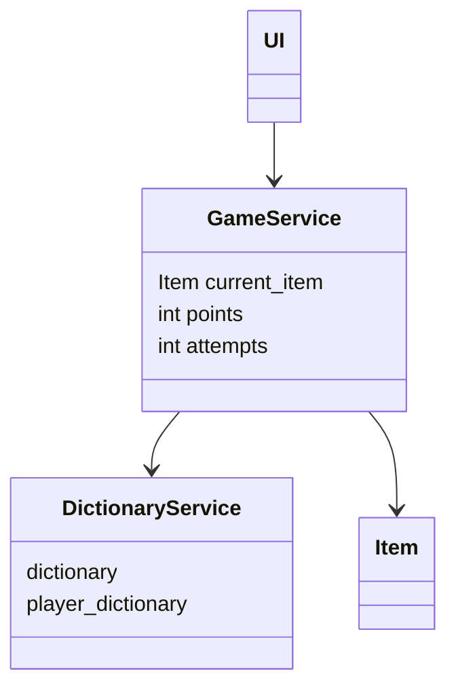
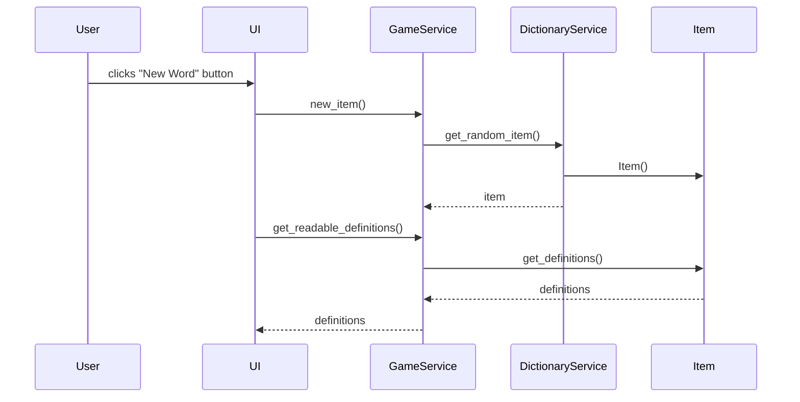

# Arkkitehtuuri

## Käytetyt kirjastot

Ohjelma käyttää Pythonin peruskirjastojen lisäksi lxml-kirjastoa xml-tiedostojen lukemiseen ja kirjoittamiseen, sekä invoke-kirjastoa tasks.py -tiedostossa olevien komentojen suorittamiseen. Lisäksi koodin testaamiseen, linttaamiseen ja formattaamiseen käytetään coverage-, pytest-, black- ja pylint- kirjastoja.

## Rakenne

Ohjelman kaikki koodi sijaitsee src-kansiossa. src-kansion sisällä oleva pakkaus services vastaa sovelluslogiikasta ja ui-pakkaus vastaa käyttöliittymästä. Entities- kansiossa on tiedosto item.py, jossa määritelty luokka Item vastaa sanakirjassa olevaa sanaa ja sen määritelmiä.

## Käyttöliittymä

Käyttöliittymässä on kaksi näkymää. Ensimmäisenä avautuvassa näkymässä pelaaja voi pelata peliä. Painamalla nappia pääsee toiseen näkymään, jossa pelaaja voi lisätä omia sanojaan ohjelman muistiin.

## Tietojen tallennus

Ohjelma voi tallentaa käyttäjän lisäämiä sanoja. Pelaajan lisäämät sanat tallennetaan kansiossa data sijaitsevaan player_dictionary.xml -tiedostoon. Mikäli tiedosto on ohjelman käynnistyessä tyhjä tai sitä ei ole, tiedosto luodaan automaattisesti. Muita tietoja, kuten pistemääriä, ohjelma ei tallenna.

## Kaavioita

Luokka UI on riippuvainen luokasta GameService, joka taas on riippuvainen luokista DictionaryService ja Item. DictionaryService lukee sanoja "dictionary.xml" ja "player_dictionary.xml" nimisistä xml-tiedostoista.

Käyttöliittymän päänäkymässä pelaajalle annetaan lista arvattavan sanan määritelmiä, ja pelaaja voi kirjoittaa arvauksensa tekstikenttään.

Seuraava kaavio kuvaa ohjelman toimintaa, kun käyttäjä klikkaa "New Word" nappia:

