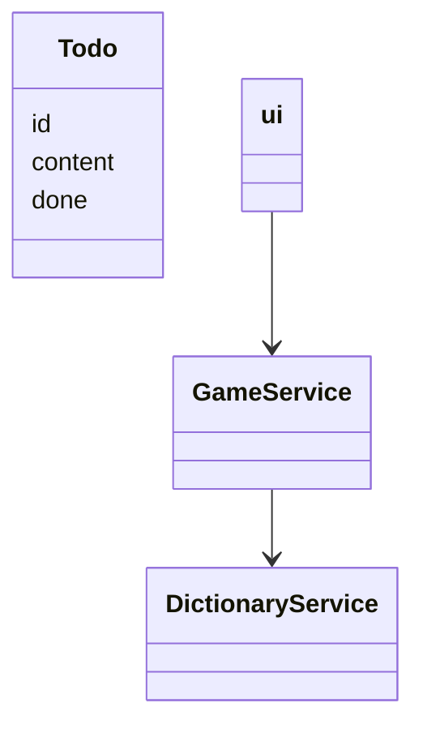
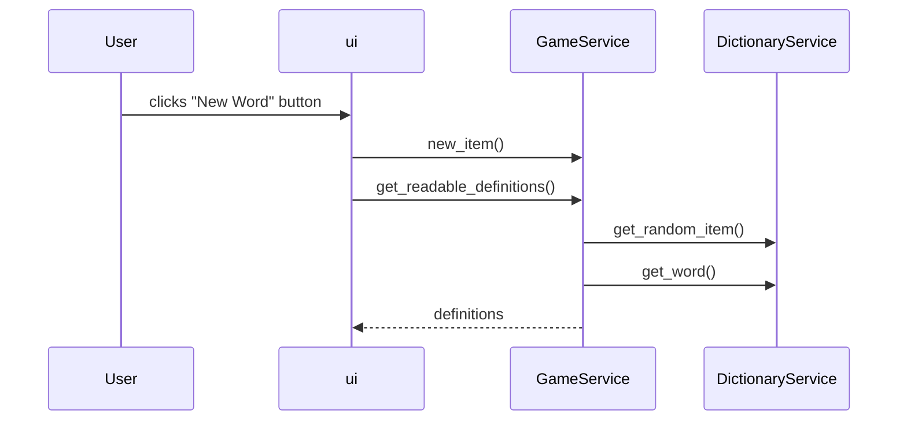

```mermaid
    classDiagram
        GameService --> DictionaryService
        DictionaryService
        class Todo{
            id
            content
            done
        }

        ui --> GameService
```

```mermaid
    sequenceDiagram
        User ->> ui: clicks "New Word" button
        ui ->> GameService: new_item()
        ui ->> GameService: get_readable_definitions()
        GameService ->> DictionaryService: get_random_item()
        GameService ->> DictionaryService: get_word()
        GameService -->> ui: definitions
```