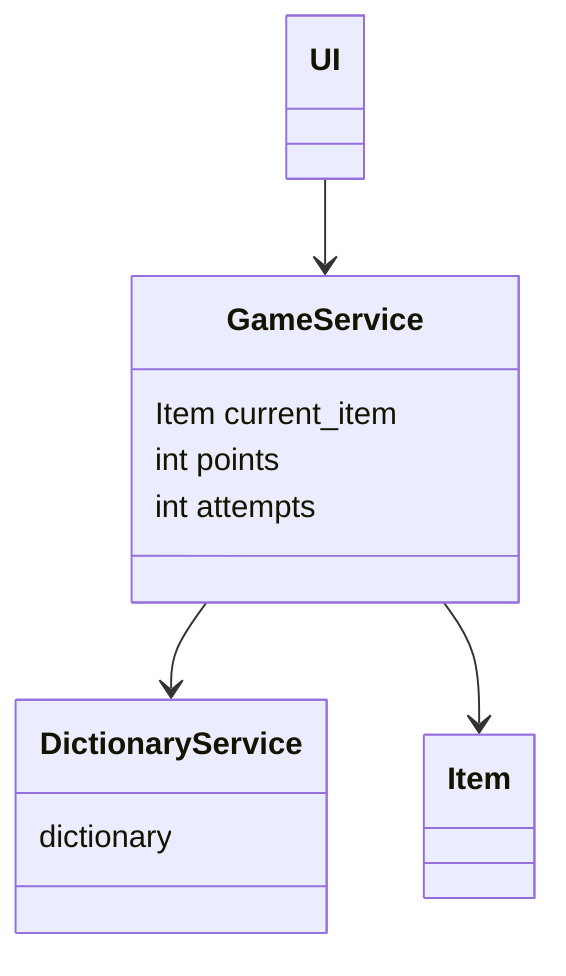
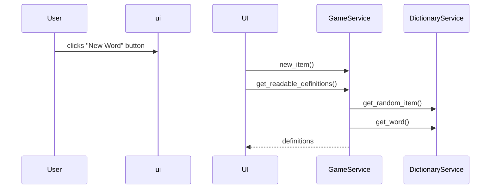

Luokka UI on riippuvainen luokasta GameService, joka taas on riippuvainen luokista DictionaryService ja Item. DictionaryService lukee sanoja "dictionary.xml" nimisestä xml-tiedostosta.

Käyttöliittymän päänäkymässä pelaajalle annetaan lista arvattavan sanan määritelmiä, ja pelaaja voi kirjoittaa arvauksensa tekstikenttään.

Esimerkiksi ohjelman toiminta, kun käyttäjä klikkaa "New Word" nappia:
