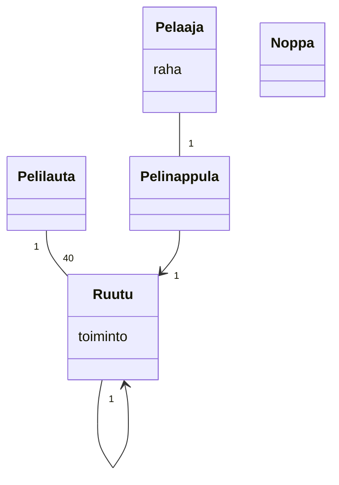

```mermaid
 classDiagram
      Pelilauta "1" -- "40" Ruutu
      Pelaaja "" -- "1" Pelinappula
      Pelinappula "" --> "1" Ruutu
      Ruutu "" --> "1" Ruutu
      class Pelilauta{
         
      }

      class Ruutu{
          toiminto
      }
      class Pelaaja{
          raha
      }

      class Pelinappula{

      }

      class Noppa{

      }
```